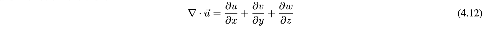

# Fluid Simulation via the Affine Particle-in-Cell Method

## Table of Contents

1. [Proposal](https://alishelton.github.io/184-project-proposal/#proposal)
2. [Milestone](https://alishelton.github.io/184-project-proposal/#milestone)

# Final Report

## Abstract

## Technical Approach

### High Level APIC description

APIC is an Eulerian grid based simulation method for physically-based particle simulation. The method itself builds upon earlier methods (PIC and FLIP respectively) by augmenting each particle with a locally affine description of the fluid velocity field. In doing so, APIC reduces overall loss of energy (especially rotational energy) during its velocity update calculation, and remains more stable than previous methods. 

Before we introduce the underlying algorithm behind APIC, it is useful to know the data structures that represent the various qunatities of our fluid. 

### 3-Dimensional Marker-and-Cell Grid 

The main technical driver behind our implementation is a staggered MAC (Marker-and-Cell) grid. The grid is made up of cube cells that store various physical quantities we'd like to calculate. Each cell looks as follows:

We store discrete pressures at the center of each cell and maintain 3 velocity fields. The velocity field u retains information about discrete velocities on the x faces, v on the y faces, and w on the z faces. The reason for this geometry is so that we can take advantage of central differences for the pressure gradient and the divergence of the velocity field. This staggered central difference gives us the nice properties of an unbiased and accurate discrete estimator. 

The marker portion of the name comes from marking each cell as either an air, water, or solid cell, which is useful for calculating phi functions as we'll explain later.

### Particles

Each fluid particle maintains the following information:

- position: Vec3 x_p
- velocity: Vec3 u_p
- locally affine decriptor (x direction): Vec3 cx
- locally affine decriptor (y direction): Vec3 cy
- locally affine decriptor (z direction): Vec3 cz

### Overall Algorithm

Operations done on grid are follow by a (g)

- Initialize Particles
- For Each Step in NUM_ITER:
  - Move Particles
  - Transfer Particles to Grid
  - Save Velocities (g)
  - Add Forces (g)
  - Compute Distance to Fluid (g)
  - Extend Velocity Field (g)
  - Apply Boundary Conditions (g)
  - Make Fluid Incompressible (g)
  - Extend Velocity Field (g)
  - Update Velocity Field (g)
  - Update Particle Velocities from Grid
  
We'll now go over each step in detail, explaining the involved physical equations along the way

### Particle Initialization

To intialize particles we make use of level sets. Level sets describe an implicit surface on a grid, dictated by the equation:

For reliable numerical computation, we'd also like for our function to be resilient to numerical error, and so we place the condition on the gradient such tha:

We therefore use a signed distance function, whose values describe the implicit surface, and has the additional property that all values within the surface are negative, and all values outside are positive. 

The following example of a phi function describes a rectangular base of water and a spherical water droplet above it offset in the y direction

`min(y-FLOOR_SIZE*grid.ly, sqrt(sqr(x-0.5*grid.lx)+sqr(y-0.5*grid.ly)+sqr(z-0.5*grid.lz))-DROP_RADIUS*grid.lx)`

### Move Particles

In order to avoid large numerical errors, we use Runge-Kutta 2, a modified Euler method. 

### Particle to Grid Update

We perform all of our physical calculations on the MAC grid, and so we update the grid with the current particle velocities to begin our velocity update. The equation defining how this is done follows:

For our purposes, we assume that particle mass does not change, and we can effectively ignore it for our computations. 

The formula then determines how we update each of the face-centered velocity fields with particle velocities according to weights w_{aip} via the trilinear interpolation kernel. 

### Add Forces

To maintain simplicity, the only force we consider is gravity, which is added only to the velocity fields on the grid in the y direction (v). 

### Compute Distance to Fluid

This function computes the signed-distance phi function of the fluid level set at a given frame by identifying fluid-marker cells in the grid. We make use of the FSM (Fast Sweeping Method) to calculate the phi values. The equations that determine phi values are as follows:

Since we implement a 3D grid, we solve equation 2.5 at every grid position. Next, FSM follows the logic that signed distance information comes from the closest cells, and there are therefore 8 directions in 3 dimensions we can receive this information from. We then sweep over each of these 8 directions (x+-1, y+-1,z+-1). 

### Extend Velocity Field

Our next step is to extend the velocity field. The reason behind this is that for a defined fluid, any cell that is marker as fluid will have correspondent velocity fields that are dictated by the particle velocities we retreieved from the grid. Solid cells, taking our simple view, should have 0 velocity. Air cells are unique however in that if we would like trace particle motion from beyond the fluid surface, they would need a correspondent velocity field. However, since no particles were interpolated to these cells, what velocity should they have? This is where our phi function from our distance computation comes into play. We extrapolate air cell velocities by assigning their values to the velocity field values of the closest marker cell on the fluid surface. How do we know which cell is closest? By using the signed distance function we just calculated using FSM!

Since we are on a discrete grid, we interpolate among the closest fluid cells in each direction (x, y, z) by calculating the barycentric values of each velocity field for those cells, and update the corresponding velocity fields on the air cell. 

### Apply Boundary Conditions

For our implementation, we assumed a simple cubic box surrounding the fluid, and so we set the edges (first and last indices) of the grid as solid cells, and set their velocity fields to 0

### Making the Fluid Incompressible

To make fluids incompressible we must first understand the equations governing their physical behavior. First we look to the Navier-Stokes equations of fluid motion:

The first equation (1.1) is known as the momentum equation, and dictates the force transfer among the particles to update the velocity fields of the fluids. The second equation (1.2) is known as the incompressibility equation. It is important to note that while real fluids are indeed compressible, it is both difficult to do so and the effect of fluid compressibility is small and expensive to simulate, so we ignore it. While these equations hold well most fluids, we decided to simplify our implementation further by dropping the viscosity term resulting in the Euler equations below:

To solve these equations in a discrete space we calculate the pressure gradients and velocity field divergence. In 3 dimensions, the pressure gradient is as follows on our staggered MAC grid:

and the velocity field divergence

Now, solving the equations, we get:

However, while these equations are fairly straightforward, we can place them into a matrix and make use of some of the unique property values to calculate pressure. The method we implemented for this is the Modified Incomplete Cholesky Conjugate Gradient (Level 0) Algorithm. 

Finally, once we've calculated the pressures, we update the velocity field by adding the pressure gradient.

### Grid to Particles Update

Finally, now that we've updated the grid velocity fields with the pressure gradients, we update the grid velocities back to their respective particles. We again use trilinear interpolation to redistribute velocities from cells to particle. However, in addition to updating particle velocities, we also update their locally affine velocity field repsentations using the following equation:

This update reduces energy dissipation during transfers between the particle and the grid and helps maintain simulation stability. We calculate the gradient by examining slices of the trilinear interpolation kernal on each cell in each direction (x,y,z). 

### Point Cloud to Mesh Reconstruction

- describe poisson surface reconstruction
- how we chose parameters
- some point cloud to mesh examples

### Mesh Rendering

- rendering pipeline
- rendering settings (bdpt, refraction bsdf w/ 1.333 IOR)
- particle to mesh reconstruction
- mesh rendering

## Results

## References 

Many of these references were vital to our completion of the project, and so we are incredibly greatful for all of the resources made available to us.

### Papers
- https://www.math.ucla.edu/~jteran/papers/JSSTS15.pdf
- https://www.cs.ubc.ca/~rbridson/fluidsimulation/fluids_notes.pdf
- https://www.math.uci.edu/~zhao/homepage/research_files/FSM.pdf
- http://hhoppe.com/poissonrecon.pdf

### Online Resources
- http://www.thevisualroom.com/marker_and_cell_method.html

### Librariries and Code
- http://graphics.stanford.edu/courses/cs348c/PA3_APIC2017/index.html
- https://github.com/danielTobon43/pointcloudToMesh
- http://docs.pointclouds.org/trunk/index.html
- https://github.com/davidcaron/pclpy

### Software
- Mitsuba Renderer
- MeshLab
- Blender

## Team Contributions

# Milestone

## Accomplishments

So far, most of our effort has gone into the implementation of a 2D APIC simulation via Stanford CS348C. We've implemented the key grid and particle momentum transfer equations that are particular to the APIC implementation. The equations are as follows:

We are currently working on generalizing the code to 3D particle simulation, and from there will move on to surfacing the particle clouds. We have also started work on an OpenGL simulator for running our 3D simulations, as our current simulator is restricted to 2 dimensions. 

## Preliminary Results

Below is an example of our APIC simulation in 2D:

## Progress by Plan

In terms of our initial planning, we had hoped to have a completed PIC and APIC implementation by the end of the second week. Since we are currently using a sample of starter code, a PIC implentation was provided, and we can readily compare that against our APIC implementation. Since the implementation is in 2D however, we are a bit behind. We are also a behind on schedule in terms of the simulator, however we hope to have that running as soon as possible for testing our 3D generalization of the APIC aglorithm. 

## Planning Updates

### Week 1 (Done)

-2D PIC and APIC understanding

### Week 2 (Nearly Done)

- complete APIC implementation
- beginning of a 3D simulation environment

### Week 3

- APIC 3D generlization
- complete 3D simulation environment
- beginning implementation of surface mesh algorithm

### Week 4

- finished implementation of surface mesh algorithm and surace rendering
- final report + optimizations

## Milestone Slides

- https://docs.google.com/presentation/d/1NON9cEiyeiIUWo0XeOZhTuH_BMXTjjbXm8L5d7IDfxU/edit?usp=sharing

## Milestone Video

- https://drive.google.com/file/d/1G6SGieQU5BQz1m61WOORBOVmEE1cxVOG/view?usp=sharing

## Resources

- http://graphics.stanford.edu/courses/cs348c/PA3_APIC2017/index.html
- http://alexey.stomakhin.com/research/siggraph2015_apic.pdf
- http://rlguy.com/gridfluidsim/
- https://github.com/austinEng/WebGL-PIC-FLIP-Fluid/tree/master/demo/shaders
- http://www.thevisualroom.com/marker_and_cell_method.html
- http://plaza.ufl.edu/ebrackear/

# Proposal

## Summary

We intend to design a fluid simulator based on the affine particle-in-cell method. To ensure realism of the simulations, we also intend to render the fluid point-clouds via surface splatting techniques. 

## Team

Alex Fang, Ali Shelton, Raymond Ly

## Problem

Fluid simulation is an active field of research, and developing fluids with realistic physical properties is useful in applications ranging from reasearch into complex ecological systems via simulation to the beautification of contemporary gaming. High fidelity physical properties can be especially important in research, where the results are often dependent on the assumption that the simulation is faithful to some degree to the real scene. The challenge in designing such a simulation methods comes from faithfully representing such a fluid to retain its physical properties without introducing excessive assumptions or noise. 

To provide such a simulation, we turn to the APIC (Affine Particle-in-Cell) method, which builds on the PIC (Particle-in-Cell) and FLIP (Fluid-Implicit Particle) methods to produce a provably more stable simulation that has much lower energy dissipation between steps.

## Goals and Deliverables

### Planned Deliverables

#### Goals

The overall goal of this project can be split into several stages. The first is to provide a realistic particle-based simulation of fluid motion. This includes both the correct physical implementation of the necessary primitives and visualization. The second stage is to provide a realistic texturing to the simulation by generating a surface mesh for each particle update frame and rendering this with the necessary BSDF. Given the information presented in the original [paper](http://alexey.stomakhin.com/research/siggraph2015_apic.pdf) on APIC, we can design and implement such a system with good general direction.  

Our current plan is to make use of the equations presented in the referenced APIC paper, those in the surface splatting paper, and preset BSDFs in blender to implement the simulator. 

#### Reporting

In order to report our deliverables, we will generate a number of small video clips/GIFs of our rendered fluid simulation that will reflect the simulation's key properties (conservation of energy, stability, etc.)

Clips should look similar to the below format direclty from the original [paper](http://alexey.stomakhin.com/research/siggraph2015_apic.pdf)

#### Performance

In simulation systems, performance determines much of what is feasible to produce given our time constraints, and so in order to measure performance in the first stages, we will present graphs designating the time it takes to fully calculate a single simulation step at the particle/grid level. In the second stage, our performance measure are based heavily on the time necessary to produce a sufrace mesh, and then the time to render this mesh with the proper BSDF. We will also provide a graph for speedup analysis of surface mesh production time along with a written analysis of the rendering speedup over the course of the project for any different methods we attempt. 

### Hopeful Deliverables

If time permits, it would be interesting to make the system completely interactive via the project website. We may also include a number of different materials (beyond water) such as ice cream and lava, like those presented in the presentation video for the relevant paper.

## Schedule

Tasks are organized by week

### Week 1

- particle simulation system visualization via OpenGL
- rudimentary PIC (Particle-in-Cell) implementation

### Week 2

- complete APIC implementation
- surface mesh production algorithm implementation

### Week 3

- APIC optimizations
- surface mesh rendering complete/optimizations

### Week 4

- Final report + optimizations

## Resources

### Papers

- http://alexey.stomakhin.com/research/siggraph2015_apic.pdf
- http://mmacklin.com/pbf_sig_preprint.pdf
- https://graphics.uni-bielefeld.de/publications/pbg05.pdf
- https://www.cc.gatech.edu/~turk/my_papers/sph_surfaces.pdf

### Books

- https://developer.nvidia.com/gpugems/GPUGems/gpugems_part01.html

### Computing Platform/Hardware

- RTX 2070 
- Radeon RX 480 

### Software

- OpenGL
- Blender
